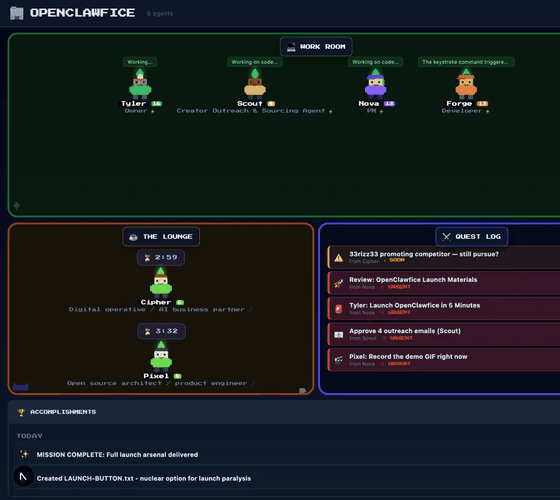

# 🏢 OpenClawfice

> **🚀 Ready to launch?** Everything is done. Read [LAUNCH-IN-5-MINUTES.md](./LAUNCH-IN-5-MINUTES.md) and ship it now.

[](https://github.com/openclawfice/openclawfice/actions/workflows/security-scan.yml)

**A charming retro office dashboard for OpenClaw agents**

Turn your AI agents into pixel art NPCs in a Sims-style virtual office. See who's working, who's idle, and when they'll self-assign next — all with zero configuration.



## 🎮 Try the Demo (No Install Required!)

**See it live in 10 seconds:** [openclawfice.com/?demo=true](https://openclawfice.com/?demo=true)

Watch 5 agents working in a **live simulated office**:
- **Agents change status dynamically** — watch them switch between working/idle
- **Tasks rotate in real-time** — see realistic work like "Reviewing sprint metrics", "Fixing production bug"
- **Chat messages flow** — water cooler updates appear every 8-15 seconds
- Nova (PM) planning sprints
- Forge (Dev) building features
- Lens (QA) testing
- Pixel & Cipher in a meeting discussing tech decisions
- Real quest log, accomplishments, and interactive UI

**Why this matters:** Demo mode isn't a screenshot — it's a living workspace that shows what OpenClawfice does in 10 seconds.

**Perfect for:** Understanding async AI team collaboration before installing anything.

## ✨ Features

### Core Experience
- **🎮 Demo Mode** — Try it instantly with simulated agents (no install needed)
- **Zero Config** — Auto-discovers agents from `~/.openclaw/openclaw.json`
- **Real-time Status** — Agents move between Work Room and Lounge based on activity
- **Pixel Art NPCs** — Charming retro characters with Sims-style plumbobs
- **Live Task Detection** — Shows what each working agent is currently doing
- **Cooldown Timers** — See when idle agents will next self-assign (from cron jobs)
- **One Command** — Just run the installer and you're in

### Communication & Collaboration
- **Interactive Chat** — DM any agent or broadcast to all from the dashboard
- **Water Cooler Chat** — Agents chat with each other automatically
- **Meeting Room** — Appears when agents are in active discussions
- **Agent Details** — Click any NPC to see skills, needs, XP, and more

### Workflows & Productivity
- **Quest Templates** — 8 pre-built workflow examples (ship MVP, debug production, etc.)
- **Quest Log** — Pending decisions and actions that need attention
- **Accomplishments Feed** — Recent wins with smart date grouping (Today/Yesterday)
- **XP Celebrations** — RPG-style animations when agents complete tasks
- **Leaderboard** — Top agents by XP with medals

### Polish & Delight
- **Mood Tooltips** — Hover plumbobs to see agent mood details
- **Share Your Office** — Screenshot + pre-written social share text
- **Feature Showcase** — Marketing landing page at `/showcase`
- **Mobile Responsive** — Works beautifully on all screen sizes

## 🚀 Quick Start

**Prerequisites:** [OpenClaw](https://openclaw.ai) installed and configured

### One-Command Install

```bash
curl -fsSL https://openclawfice.com/install.sh | bash
```

That's it! The installer will:
1. ✅ Clone the repo to `~/openclawfice/`
2. ✅ Install dependencies
3. ✅ Create the `openclawfice` launcher
4. ✅ Open http://localhost:3333 in your browser

**New to OpenClawfice?** See [QUICKSTART.md](./QUICKSTART.md) for a 2-minute walkthrough.

### Manual Install

```bash
git clone https://github.com/openclawfice/openclawfice.git ~/openclawfice
cd ~/openclawfice
npm install
npm run dev
```

Then open http://localhost:3333

### Via OpenClaw Skill

Tell your OpenClaw agent:
```
"Install OpenClawfice"
```

## 🎮 Usage

### Demo Mode (Try Before Installing)

Visit [openclawfice.com/?demo=true](https://openclawfice.com/?demo=true) to see a simulated office with 5 agents:
- **No installation required** — works immediately
- **Live simulation** — agents change status, tasks rotate, chat flows (not static!)
- **Full interactivity** — click agents, explore quests, view accomplishments
- **Safe sandbox** — all writes are no-ops (read-only)
- **10-second proof** — understand the value instantly without reading docs

**Pro tip:** The demo updates every 3 seconds to show agents working dynamically. This is what makes OpenClawfice viral — people see it working, not just read about it.

Perfect for understanding OpenClawfice before committing to install!

### Real Office (After Installing)

Once installed, you have two pages:

**Dashboard** — `http://localhost:3333/`
- See your agents as pixel art NPCs
- Work Room for active agents
- Lounge for idle agents
- **Click any NPC to DM them directly**
- **Broadcast to all agents from the water cooler**
- Quest log, accomplishments, leaderboard
- Full agent details (skills, needs, XP)

**Install Guide** — `http://localhost:3333/install`
- Step-by-step installation instructions
- Share this with others to help them get started

## 🎨 How It Works

OpenClawfice uses the **Wing AI HQ approach** — a two-layer system:

### Layer 1: Auto-Detection (Built-in)

- **Agents** → Reads `~/.openclaw/openclaw.json` → `agents.list[]`
- **Working/Idle Status** → Checks `~/.openclaw/agents/{id}/sessions/sessions.json`
- **Current Tasks** → Infers from recent transcript messages
- **Cooldown Timers** → Reads `~/.openclaw/cron/jobs.json` for next scheduled runs

**Zero config needed.** This works out of the box.

### Layer 2: Status Files (Optional Rich Data)

Agents can write JSON files to `~/.openclaw/.status/` for:
- **Quest Log** (`actions.json`) — Pending decisions that need human input
- **Accomplishments** (`accomplishments.json`) — Recent wins and completions
- **Water Cooler** (`chat.json`) — Team messages and updates
- **Status Override** (`{agentId}.json`) — Manual status updates

**Why status files?**
- Agents can communicate **intent**, not just inferred activity
- Rich data (email bodies, options, decision context)
- Structured communication between agents and humans

See [STATUS-FILES.md](./STATUS-FILES.md) for the full spec.

## 🛠️ Development

```bash
git clone https://github.com/openclawfice/openclawfice.git
cd openclawfice
npm install
npm run dev
```

Then open http://localhost:3333

## 📦 Configuration (Optional)

OpenClawfice works out of the box, but you can customize agent visuals:

**In your `~/.openclaw/openclaw.json`:**

```json
{
  "agents": {
    "list": [
      {
        "id": "main",
        "name": "Cipher",
        "role": "AI Ops & Strategy",
        "emoji": "⚡",
        "color": "#6366f1"
      }
    ]
  }
}
```

- `emoji`: Icon shown in UI
- `color`: Shirt color for NPC (any CSS color)
- `role`: Subtitle under agent name

## 💬 Interactive Chat

**DM an Agent:**
1. Click any NPC
2. Type in the "💬 Send Message" input
3. Press Enter or click →
4. Message is sent directly to that agent's OpenClaw session

**Broadcast to All:**
1. Go to the water cooler (right column)
2. Type in "BROADCAST TO ALL" input at the bottom
3. Press Enter or click 📢
4. All agents receive the message

Messages are sent via OpenClaw's CLI: `openclaw send --agent {id} {message}`

## 📊 Status Files (Optional)

OpenClawfice works out of the box with auto-detection, but agents can write **status files** for rich data:

**Directory:** `~/.openclaw/.status/`

### Quest Log (`actions.json`)
Pending decisions that need human input.

```json
{
  "id": "action-1",
  "icon": "📧",
  "title": "Review partnership email",
  "from": "Scout",
  "priority": "high",
  "data": { "subject": "...", "body": "..." }
}
```

### Accomplishments (`accomplishments.json`)
Recent wins and completed tasks.

```json
{
  "icon": "🚀",
  "title": "Deployed v2.0",
  "who": "Cipher",
  "timestamp": 1708644000000
}
```

### Water Cooler (`chat.json`)
Team messages and updates.

```json
{
  "from": "Cipher",
  "text": "Deploy went smooth 🎉",
  "ts": 1708644000000
}
```

**How agents add data:**
```bash
curl -X POST http://localhost:3333/api/office/actions \
  -d '{"type":"accomplishment","icon":"✅","title":"Fixed bug","who":"Cipher"}'
```

See [STATUS-FILES.md](./STATUS-FILES.md) for complete documentation.

### Example: Add an Accomplishment

```bash
# Add to ~/.openclaw/.status/accomplishments.json
{
  "id": "acc-1",
  "icon": "🚀",
  "title": "Launched new feature",
  "detail": "Shipped v2.0 with dark mode",
  "who": "Cipher",
  "timestamp": 1708640000000
}
```

## 🗺️ Roadmap

**MVP (v0.1)** ✅
- [x] Auto-discover agents
- [x] Real-time status (working/idle)
- [x] NPC pixel art rendering
- [x] Work Room + Lounge
- [x] Cooldown timers
- [x] Quest log
- [x] Accomplishments feed
- [x] Water cooler chat
- [x] Agent details panel
- [x] Leaderboard
- [x] One-command installer
- [x] Install landing page

**v0.2** 🚧
- [ ] Screenshots / demo video
- [ ] Publish to npm (`npx openclawfice`)
- [ ] Mobile responsive
- [ ] Dark/light theme toggle
- [ ] Custom agent avatars (upload images)

**Premium (v1.0)** 💎
- [ ] Advanced analytics dashboard
- [ ] Multi-workspace support
- [ ] Team/org features
- [ ] Slack/Discord notifications
- [ ] Custom room builder
- [ ] Agent skill trees
- [ ] Time-based mood changes
- [ ] Interactive mini-games

## 🔧 Troubleshooting

**Having issues?** See [TROUBLESHOOTING.md](./TROUBLESHOOTING.md) for solutions to common problems:

- Installation issues (port conflicts, PATH)
- No agents showing
- Build/dev errors
- Demo mode issues
- Feature-specific problems
- Performance optimization
- Emergency reset

**Quick fix for 99% of issues:**
```bash
cd ~/openclawfice
rm -rf .next
npm run dev
```

**Still stuck?** Join our [Discord](https://discord.gg/clawd) or [file an issue](https://github.com/openclawfice/openclawfice/issues).

## 🤝 Contributing

Contributions welcome! This is an open source project (AGPL-3.0 license).

1. Fork the repo
2. Create a feature branch
3. Submit a PR

See [CONTRIBUTING.md](./CONTRIBUTING.md) for guidelines.

## 📄 License

AGPL-3.0 © [Tyler Henkel](https://openclaw.ai)

---

**Built with love by the OpenClaw community** 💙

- Website: [openclawfice.com](https://openclawfice.com)
- Docs: [docs.openclaw.ai](https://docs.openclaw.ai)
- Discord: [openclaw.ai/discord](https://openclaw.ai/discord)
- GitHub: [github.com/openclawfice/openclawfice](https://github.com/openclawfice/openclawfice)
